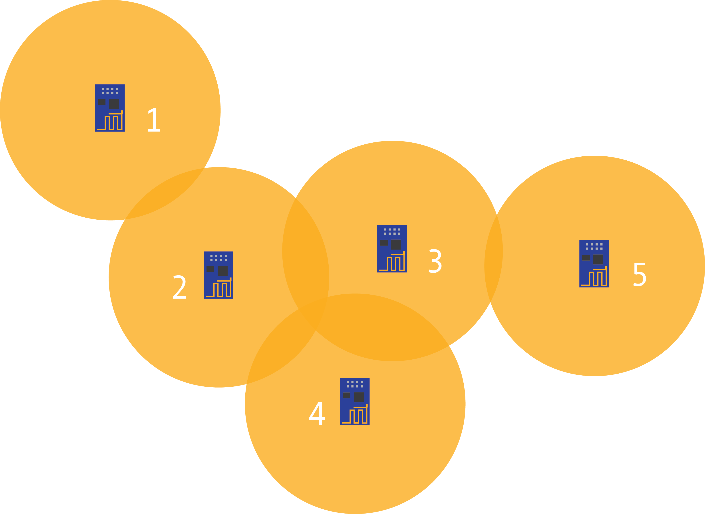
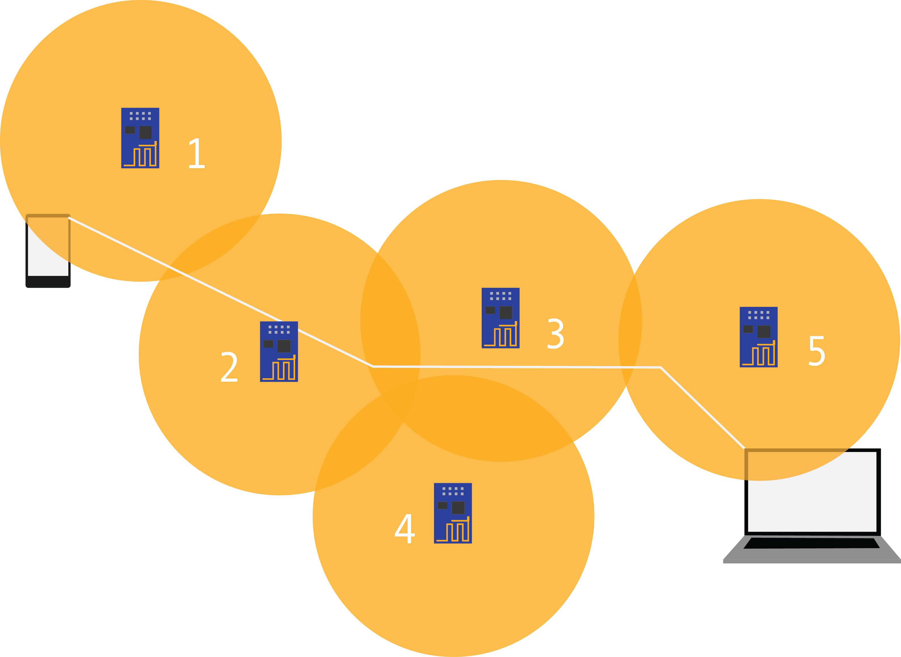

#Defining Mesh Network for ESP8266

An ESP8266 Mesh Network __is__ a network:

- Where any node in the network can communicate with any other node in the network
- Where the range is determined and increased by each node in the network

An ESP8266 Mesh Network __may__:

1. Be a hidden network that pre-programmed ESP8266 devices automatically connect to without SSID advertisement.
2. Be a visible network that any device may connect to like a traditional wifi Access Point.
3. Have the functionality to piggy-back off of an existing public wifi network to boost connection availability and speed.

The former (1) is a product of the network itself and is inherently how the network will function in order to maintain its "meshy-ness", however, the latter (2) is optional and if enabled, requires that the network share one unique advertised SSID.

 

The above example illustrates the hidden network (1) that the pre-programmed ESP8266 can create and maintain. This allows any ESP to communicate with any other ESP within range of it to communicate with it as well as any other ESP that device is in range of. Here, traffic from ESP #1 can be routed through ESPs #2, #3 (and/or #4) in order to communicate with ESP #5.

This example illustrates the visible network (2) and incorporates non-ESP8266 devices. Here a mobile phone can communicate with a laptop computer by routing their traffic through ESPs #1, #2, #3, and #5.

## Mesh Network Resources
- [How Mesh Networks Work (video)](https://www.youtube.com/watch?v=tYLU755T6_I)
- [OLSR Protocol](https://en.wikipedia.org/wiki/Optimized_Link_State_Routing_Protocol)
- [Batman Protocol](https://en.wikipedia.org/wiki/B.A.T.M.A.N.)